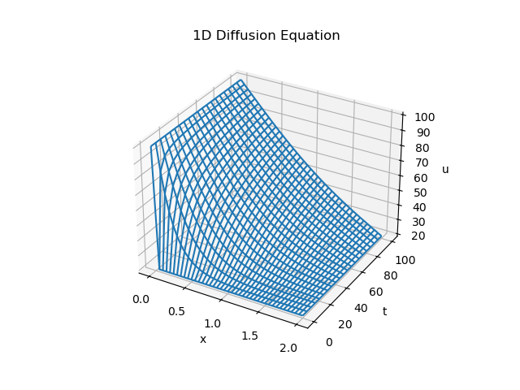
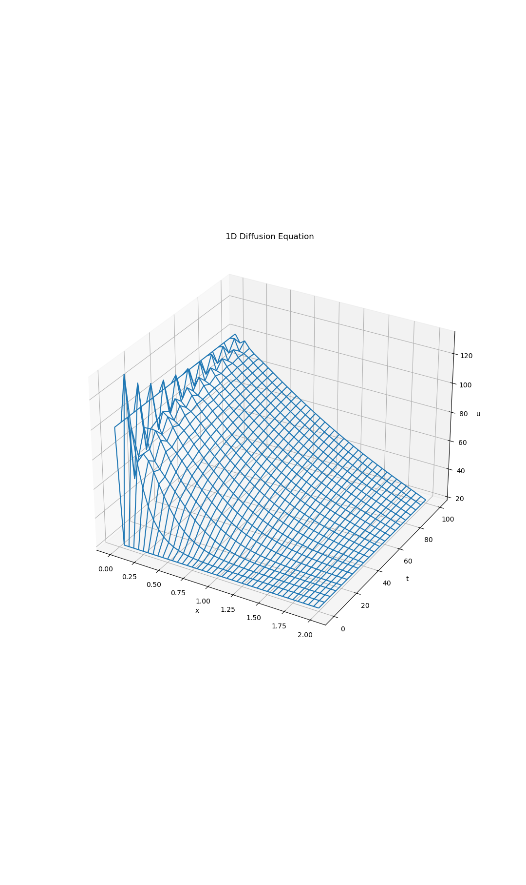

# Finite-Difference-Methods-for-PDEs
A collection of finite difference methods for solving two common partial differential equations (PDEs), featuring implementations and comparisons. For **parabolic problems** (e.g. the diffusion equation), the first method considered is an *explicit method*, which uses the below approximations. 
- Forward difference approximation of $\mathcal{O}(h_t)$ for the time derivative

$$\dfrac{\partial u}{\partial t}(x_i,t_{l})\approx \dfrac{u^{l+1}_i-u^l_i}{h_t}, \quad i=1,\ldots,m, \quad  l=0,\ldots,N-1.$$

- Central difference approximation of $\mathcal{O}(h^2_x)$ for the space derivative

$$\dfrac{\partial^2 u}{\partial x^2}(x_i,t_{l})\approx \dfrac{u^{l}_{i-1}-2u^{l}_i+u^{l}_{i+1}}{h^2_x}, \quad i=1,\ldots,m, \quad  l=0,\ldots,N-1.$$

The second method is an *implicit method*, which uses the below approximations. 
- Backward difference approximation of $\mathcal{O}(h_t)$ for the time derivative

$$\dfrac{\partial u}{\partial t}(x_i,t_{l+1})\approx \dfrac{u^{l+1}_i-u^l_i}{h_t}, \quad i=1,\ldots,m, \quad  l=0,\ldots,N-1.$$

- Central difference approximation of $\mathcal{O}(h^2_x)$ for the space derivative

$$\dfrac{\partial^2 u}{\partial x^2}(x_i,t_{l+1})\approx \dfrac{u^{l+1}_{i-1}-2u^{l+1}_i+u^{l+1}_{i+1}}{h^2_x}, \quad i=1,\ldots,m, \quad  l=0,\ldots,N-1.$$

The third and final method is the *Crank-Nicolson method*, which takes an average of the two previous methods. This method is of order $\mathcal{O}(h^2_t)$ and $\mathcal{O}(h^2_x)$. Like the implicit method, it is unconditionally stable. The explicit method is stable if and only if $s\le 0.5$ where 

$$s=\frac{D h_t}{h^2_x},$$

such that $D>0$ represents the diffusion coefficient. For **hyperbolic problems** (e.g. the wave equation), an **explicit method** is used with the below approximations.

- Central difference approximation of $\mathcal{O}(h^2_t)$ for the time derivative

$$\dfrac{\partial^2 u}{\partial t^2}(x_i,t_{l})\approx \dfrac{u^{l-1}_{i}-2u^{l}_i+u^{l+1}_{i}}{h^2_t}, \quad i=1,\ldots,m, \quad  l=0,\ldots,N-1.$$

- Central difference approximation of $\mathcal{O}(h^2_x)$ for the space derivative

$$\dfrac{\partial^2 u}{\partial x^2}(x_i,t_{l})\approx \dfrac{u^{l}_{i-1}-2u^{l}_i+u^{l}_{i+1}}{h^2_x}, \quad i=1,\ldots,m, \quad  l=0,\ldots,N-1.$$

This method is stable if and only if $s\le 1$ where

$$s=\frac{c^2 h^2_t}{h^2_x},$$

such that $c>0$ represents the wave speed.

**One-Dimensional Diffusion Equation** 

The stability of the explicit method depends on the chosen parameter reigme. For instance, if $T=10, m=19$ and $N=20$ then $s=0.4$ and the method is stable. However, if instead $T=20$ (keeping $m$ and $N$ unchanged) then $s=0.8$ and the method is unstable. Care should be taken when defining the boundary and initial conditions of the problem. Suppose the boundary conditions are $u(x,0)=u(2,t)=20$ and the initial condition is $u(0,t)=100$. Notice that $u(0,0)$ is inconsistent (being both 20 and 100). This inconsistency does not noticiably affect the implicit method because the data value at $u(0,0)$ is not used by the implicit method. Consider the below plots of the solution with parameters $T=100, m=39$ and $N=20$. 

Implicit Method             |  Crank-Nicolson Method
:-------------------------:|:-------------------------:
  |  

**One-Dimensional Wave Equation** 
